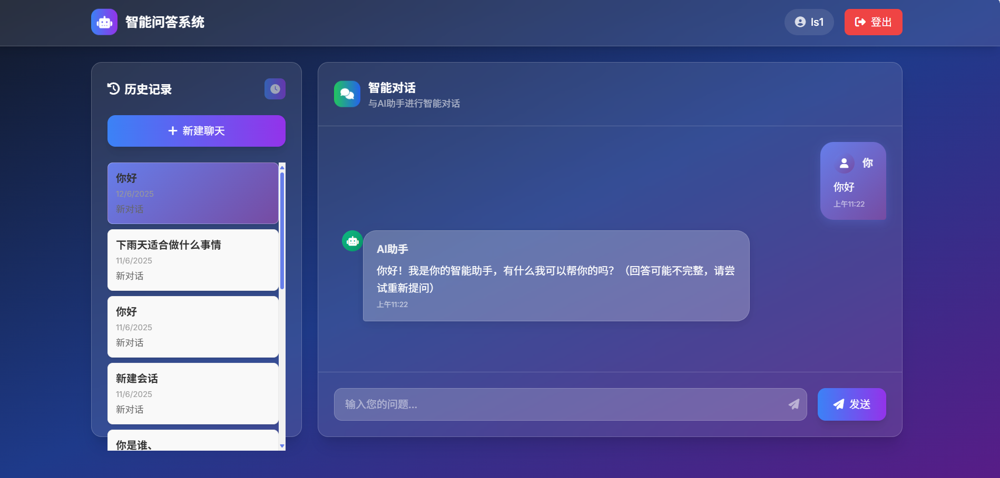

# QA系统 - 智能问答平台

## 项目概述
QA系统是一个基于Spring Boot开发的智能问答平台，支持用户注册、登录以及与AI进行实时聊天。系统集成了Spring Security用于用户认证和授权，MyBatis用于数据库操作，Redis用于缓存优化，以及Spring AI和OpenAI API实现流式聊天功能。用户可以创建会话、查看历史记录、获取会话摘要，并删除会话。

---

## 技术栈

| 类别 | 技术 |
|------|------|
| **后端框架** | Spring Boot |
| **安全框架** | Spring Security |
| **数据库操作** | MyBatis |
| **缓存** | Redis |
| **AI集成** | Spring AI, OpenAI API |
| **日志** | SLF4J |
| **其他** | Lombok, Reactor（响应式编程） |

---

## 项目结构

```plaintext
com.example.qasystem
├── 📁 config               # 配置层
│   ├── ⚙️ ModelProperties.java    # AI模型参数配置
│   ├── ⚙️ RedisConfig.java        # Redis连接池配置
│   └── ⚙️ SecurityConfig.java     # Spring Security配置
│
├── 📁 controller          # 控制层
│   ├── 🎮 ChatController.java     # 聊天API端点
│   └── 🎮 UserController.java     # 用户管理API
│
├── 📁 mapper              # 数据访问层
│   ├── 💾 ChatHistoryMapper.java  # 聊天记录CRUD
│   ├── 💾 ConversationMapper.java # 会话管理Mapper
│   └── 💾 UserMapper.java         # 用户数据Mapper
│
├── 📁 model               # 数据模型层
│   ├── 🧱 ChatHistory.java        # 聊天记录实体
│   ├── 🧱 Conversation.java       # 会话实体
│   ├── 🧱 User.java               # 用户实体
│   │
│   └── 📁 dto             # 数据传输对象
│       └── 📦 ConversationSummary.java  # 会话摘要DTO
│
├── 📁 security           # 安全模块
│   └── 🔒 CustomUserDetails.java  # 用户认证详情实现
│
└── 📁 service            # 业务逻辑层
    ├── 🔧 ChatService.java        # 聊天核心业务逻辑
    └── 🔧 UserService.java        # 用户管理服务
```

---

## 功能模块

### 用户管理
- **注册**：用户可以通过`/register`页面注册账号，系统验证用户名和邮箱的唯一性，密码使用BCrypt加密存储。
- **登录**：通过`/login`页面登录，Spring Security处理认证，成功后跳转至聊天页面`/chat`。
- **权限控制**：未登录用户只能访问注册、登录及静态资源，登录用户可访问聊天功能。

### 聊天功能
- **实时聊天**：通过`/api/chat`接口与AI进行流式对话，支持上下文记忆。
- **会话管理**：
    - 用户可通过`/api/new-conversation`创建新会话
    - `/api/conversations`查看会话列表
    - `/api/delete-conversation/{conversationId}`删除会话
- **历史记录**：
    - 通过`/api/chat-history/{conversationId}`获取指定会话的聊天记录
    - `/api/conversation/{conversationId}/summary`获取会话摘要
- **缓存优化**：使用Redis缓存聊天历史和会话数据，缓存有效期为24小时。

---

## 安装与运行

### 环境要求
- Java 17+
- MySQL 8.0+
- Redis
- OpenAI API密钥

### 配置
在`application.properties`中配置数据库、Redis和OpenAI API：

```properties
# 数据库配置
spring.datasource.url=jdbc:mysql://localhost:3306/qasystem
spring.datasource.username=root
spring.datasource.password=your_password

# Redis配置
spring.data.redis.host=localhost
spring.data.redis.port=6379

# OpenAI配置
openai.api.key=your_openai_api_key
openai.api.base-url=https://api.openai.com/v1
```

### 运行项目
1. 启动MySQL和Redis服务
2. 在IDE中运行Spring Boot主类
3. 或使用命令：`mvn spring-boot:run`

### 访问
打开浏览器，访问 [http://localhost:8080/login](http://localhost:8080/login) 进行登录或注册。

---

## 注意事项
- ✅ 确保Redis服务已启动，端口正确配置
- ✅ OpenAI API密钥需有效，且网络可访问OpenAI服务
- ✅ 聊天响应严格遵循纯文本格式，避免Markdown符号
- ✅ 会话和聊天历史数据会定期清理缓存，需注意数据持久化

---

## 后续计划
- 🌐 增加多语言支持
- ⚡ 优化AI响应速度和上下文管理
- 🤖 集成更多AI模型
- 🛠️ 添加用户个性化设置

---

## 系统截图

