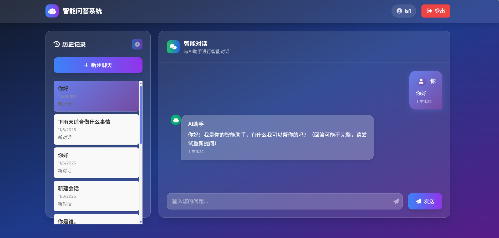

QA系统
项目概述
QA系统是一个基于Spring Boot开发的智能问答平台，支持用户注册、登录以及与AI进行实时聊天。系统集成了Spring Security用于用户认证和授权，MyBatis用于数据库操作，Redis用于缓存优化，以及Spring AI和OpenAI API实现流式聊天功能。用户可以创建会话、查看历史记录、获取会话摘要，并删除会话。
技术栈

后端框架: Spring Boot
安全框架: Spring Security
数据库操作: MyBatis
缓存: Redis
AI集成: Spring AI, OpenAI API
日志: SLF4J
其他: Lombok, Reactor（响应式编程）

项目结构
com.example.qasystem
├── 📁 config               # 配置层
│   ├── ⚙️ ModelProperties.java    # AI模型参数配置
│   ├── ⚙️ RedisConfig.java        # Redis连接池配置
│   └── ⚙️ SecurityConfig.java     # Spring Security配置
│
├── 📁 controller          # 控制层
│   ├── 🎮 ChatController.java     # 聊天API端点
│   └── 🎮 UserController.java     # 用户管理API
│
├── 📁 mapper              # 数据访问层
│   ├── 💾 ChatHistoryMapper.java  # 聊天记录CRUD
│   ├── 💾 ConversationMapper.java # 会话管理Mapper
│   └── 💾 UserMapper.java         # 用户数据Mapper
│
├── 📁 model               # 数据模型层
│   ├── 🧱 ChatHistory.java        # 聊天记录实体
│   ├── 🧱 Conversation.java       # 会话实体
│   ├── 🧱 User.java               # 用户实体
│   │
│   └── 📁 dto             # 数据传输对象
│       └── 📦 ConversationSummary.java  # 会话摘要DTO
│
├── 📁 security           # 安全模块
│   └── 🔒 CustomUserDetails.java  # 用户认证详情实现
│
└── 📁 service            # 业务逻辑层
├── 🔧 ChatService.java        # 聊天核心业务逻辑
└── 🔧 UserService.java        # 用户管理服务

功能模块
用户管理

注册: 用户可以通过/register页面注册账号，系统验证用户名和邮箱的唯一性，密码使用BCrypt加密存储。
登录: 通过/login页面登录，Spring Security处理认证，成功后跳转至聊天页面/chat。
权限控制: 未登录用户只能访问注册、登录及静态资源，登录用户可访问聊天功能。

聊天功能

实时聊天: 通过/api/chat接口与AI进行流式对话，支持上下文记忆。
会话管理: 用户可通过/api/new-conversation创建新会话，/api/conversations查看会话列表，/api/delete-conversation/{conversationId}删除会话。
历史记录: 通过/api/chat-history/{conversationId}获取指定会话的聊天记录，/api/conversation/{conversationId}/summary获取会话摘要。
缓存优化: 使用Redis缓存聊天历史和会话数据，缓存有效期为24小时。

安装与运行

环境要求

Java 17+
MySQL 8.0+
Redis
OpenAI API密钥

配置

在application.properties中配置数据库、Redis和OpenAI API：
spring.datasource.url=jdbc:mysql://localhost:3306/qasystem
spring.datasource.username=root
spring.datasource.password=your_password
spring.data.redis.host=localhost
spring.data.redis.port=6379
openai.api.key=your_openai_api_key
openai.api.base-url=https://api.openai.com/v1

运行项目
点击项目右上角的Run按钮，选择Spring Boot App

访问

打开浏览器，访问http://localhost:8080/login进行登录或注册。

注意事项

确保Redis服务已启动，端口正确配置。
OpenAI API密钥需有效，且网络可访问OpenAI服务。
聊天响应严格遵循纯文本格式，避免Markdown符号。
会话和聊天历史数据会定期清理缓存，需注意数据持久化。

后续计划

增加多语言支持。
优化AI响应速度和上下文管理。
集成更多AI模型。
添加用户个性化设置。

具体运行效果

